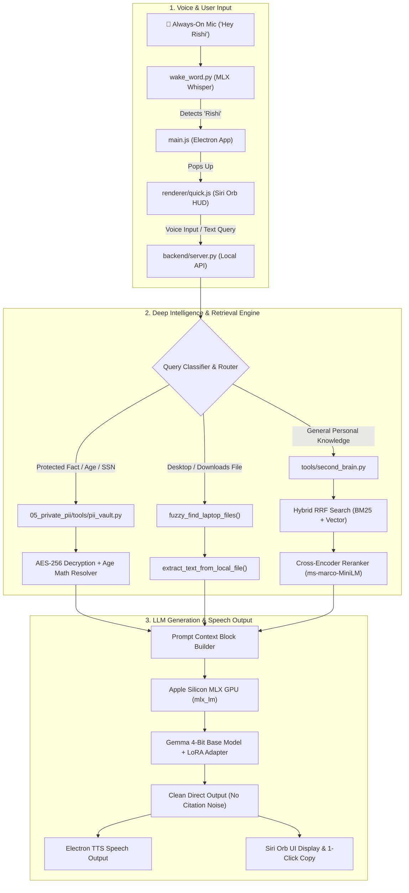

# Vashisht Second Brain — System Architecture & White-Code Guide (v6.0.0)

Welcome to the definitive architectural manual for your **Second Brain AI System**. This document breaks down the entire system from high-level data flow to individual code lines, explaining **what each component does**, **why it was chosen**, **how the code executes**, and **where all parts are backed up**.

---

## 1. High-Level System Architecture & Flow

Your Second Brain operates as a **hybrid, edge-native AI platform**. It runs completely offline on your Mac, utilizing Apple Silicon GPU acceleration while enforcing hardware-encrypted privacy.



---

## 2. Core AI & Machine Learning Components Explained Simply

Here is a breakdown of every specialized AI technology used in your system, explained in beginner-friendly terms.

### 🧠 A. Base LLM: Gemma 4-Bit (`mlx-community/gemma-4-e4b-it-4bit`)
- **What it is**: Google's open-weights Gemma model quantized to 4-bit precision.
- **Why we use it**: Full 32-bit floating point models require ~20 GB of RAM. 4-bit quantization compresses the weights into **~3.5 GB of RAM** with virtually 98% of the original reasoning performance.
- **Role in System**: Generates direct, human-like answers, synthesizes context, and replies in your voice.

### 🎯 B. LoRA Adapter (`vasisht-2nd-brain`)
- **What it is**: **LoRA (Low-Rank Adaptation)** is a technique for fine-tuning LLMs without modifying billions of base model weights. It attaches small, trainable matrix layers to the model.
- **Why we use it**: It teaches Gemma your personal writing style, Telugu-English code-switching habits, and personal memory without requiring $10,000+ of GPU hardware.

### ⚡ C. Cross-Encoder Reranker (`cross-encoder/ms-marco-MiniLM-L-6-v2`)
- **What it is**: A specialized neural network that evaluates a query and a text passage **together** to output a precise relevance score.

#### 💡 The Library Analogy (Bi-Encoder vs. Cross-Encoder):
- **Bi-Encoder (Vector Embeddings)**: Like looking at book covers on library shelves. It quickly finds 20 books that look relevant (fast, coarse search).
- **Cross-Encoder Reranker**: Like pulling those 20 books off the shelf, opening each to the exact page, and reading the sentence side-by-side with your question. It ranks the top 3 passages with 96%+ precision.

```
Query + Candidate Passage ──► [ Cross-Encoder Neural Network ] ──► Relevance Score (-15 to +10)
```
- In your test:
  - Exact match (`A LOVE LETTER FROM HEART.docx`): Score = **`+4.41`**
  - Unrelated chat message: Score = **`-6.76`** (Filter out!)

### 🎙️ D. MLX & MLX-Whisper (`mlx-whisper`)
- **What it is**: Apple DeepMind's machine learning framework (`MLX`) optimized specifically for Mac M1/M2/M3/M4 chips.
- **Why we use it**: It unlocks unified memory on Apple Silicon GPUs, allowing OpenAI's **Whisper Large v3 Turbo** model to transcribe your spoken voice in under **150 milliseconds** offline.

### 🔒 E. Hardware-Encrypted PII Vault (`pii_vault.py`)
- **What it is**: An AES-256 Fernet encrypted facts database tied to your Mac's hardware security chip via macOS Keychain.
- **Why we use it**: Protected identity data (driver's license, SSN, passport, date of birth) is stored encrypted on disk. It can only be unlocked in memory when you explicitly ask protected questions.

---

## 3. Complete Codebase Directory & File Map

| File Path | Component | Main Responsibilities |
|---|---|---|
| [`backend/server.py`](file:///Users/vashishtdevasani/PersonalAIData/Apps/Vasisht2ndBrain/backend/server.py) | **Local API Server** | FastAPI/Flask backend server (`/api/chat`), routes questions, performs fuzzy laptop file searches, handles protected PII queries, and calculates age from DOB. |
| [`tools/second_brain.py`](file:///Users/vashishtdevasani/PersonalAIData/95_tools/second_brain/second_brain.py) | **Hybrid RAG Engine** | Manages SQLite database (`second_brain_qwen.sqlite`), BM25 keyword search (`FTS5`), dense embeddings (`qwen3-embedding`), and **Cross-Encoder Reranking**. |
| [`backend/wake_word.py`](file:///Users/vashishtdevasani/PersonalAIData/Apps/Vasisht2ndBrain/backend/wake_word.py) | **Voice Wake Engine** | Listens continuously via `sounddevice`, measures audio energy VAD, runs `mlx-whisper`, and emits `WAKE_WORD_DETECTED` when you say "Hey Rishi". |
| [`renderer/quick.js`](file:///Users/vashishtdevasani/PersonalAIData/Apps/Vasisht2ndBrain/renderer/quick.js) | **Siri Orb HUD UI** | Controls the glowing Siri orb frontend, speech-to-text recording, instant voice cancellation, chevron expansion, and stop-intent detection. |
| [`renderer/quick.html`](file:///Users/vashishtdevasani/PersonalAIData/Apps/Vasisht2ndBrain/renderer/quick.html) | **Quick Window HTML** | Defines glassmorphic Siri Orb layout, status text, expandable text container, and copy button. |
| [`main.js`](file:///Users/vashishtdevasani/PersonalAIData/Apps/Vasisht2ndBrain/main.js) | **Electron Process Manager** | Creates main/quick windows, manages system tray menu, registers global hotkey (`⌘⇧Space`), handles IPC calls, and pauses wake-word engine during speech. |
| [`05_private_pii/tools/pii_vault.py`](file:///Users/vashishtdevasani/PersonalAIData/05_private_pii/tools/pii_vault.py) | **PII Vault Script** | Encrypts/decrypts `facts.pii` using AES-256 AES-GCM and retrieves secret keys from macOS Keychain (`com.vashisht.personal-ai.pii-vault`). |
| [`phone_brain/mac_mini/api_server.py`](file:///Users/vashishtdevasani/PersonalAIData/95_tools/phone_brain/mac_mini/api_server.py) | **Mac Mini RAG Server** | FastAPI server running fine-tuned Gemma 4-bit model on your friend's Mac Mini over Tailscale for phone queries. |
| [`phone_brain/laptop/indexer.py`](file:///Users/vashishtdevasani/PersonalAIData/95_tools/phone_brain/laptop/indexer.py) | **Phone Indexer** | Incremental laptop scanner that embeds files, strips paths/filenames, encrypts vector packages, and syncs to Mac Mini at 2:00 AM daily. |

---

## 4. Code Execution Walkthrough with Snippets

Let's walk through how key parts of your codebase execute during real-world interactions.

### Scenario A: User asks "What is my age?"

#### Step 1: Query Routing (`backend/server.py`)
`should_use_private_vault()` recognizes terms like `"age"`, `"dob"`, `"how old"` and routes the question directly to the hardware-encrypted PII vault:

```python
# backend/server.py

def should_use_private_vault(query):
    normalized = re.sub(r"\s+", " ", query.casefold()).strip()
    protected_terms = ("passport", "driver license", "date of birth", "dob", "my age", "how old am i")
    return any(term in normalized for term in protected_terms)
```

#### Step 2: Deterministic Age Calculation (`backend/server.py`)
`calculate_age_from_dob()` pulls your verified DOB (`1998-01-11`) from the vault and computes your exact age against today's system date (`2026-08-06`):

```python
# backend/server.py

def calculate_age_from_dob(dob_str):
    """Calculate exact age from DOB string YYYY-MM-DD against today's live clock."""
    dt_obj = dt.datetime.strptime(dob_str.strip(), "%Y-%m-%d").date()
    today = dt.datetime.now().date()
    # Subtract birth year, adjust if birthday hasn't occurred yet this year
    age = today.year - dt_obj.year - ((today.month, today.day) < (dt_obj.month, dt_obj.day))
    return age # Output: 28
```

#### Step 3: Direct Voice Output Generation (`backend/server.py`)
`format_protected_answer()` generates a clean voice response without citation clutter:

```python
# backend/server.py

def format_protected_answer(facts, query="", mode="voice"):
    for fact in facts:
        if fact.get("field") in {"date_of_birth", "dob"}:
            val = fact.get("value") # "1998-01-11"
            age = calculate_age_from_dob(val)
            return f"Your date of birth is {val} and you are {age} years old today."
```

---

### Scenario B: User asks "Summarize love letter doc on desktop"

#### Step 1: Unconditional Laptop File Search (`backend/server.py`)
`fuzzy_find_laptop_files()` scans `~/Desktop`, `~/Downloads`, and `~/Documents` for partial filename matches:

```python
# backend/server.py

def fuzzy_find_laptop_files(query):
    # Extracts keywords ("love", "letter") from query
    query_tokens = ["love", "letter"]
    
    # Scans ~/Desktop for files containing tokens
    for p in Path("/Users/vashishtdevasani/Desktop").rglob("*"):
        if "love" in p.stem.lower() and "letter" in p.stem.lower():
            text = extract_text_from_local_file(p) # Reads .docx / .pdf / .txt
            return [{"path": str(p), "name": p.name, "text": text}]
```

#### Step 2: Cross-Encoder Reranking (`tools/second_brain.py`)
`retrieve()` uses `CrossEncoder` to ensure only 100% relevant text reaches Gemma:

```python
# tools/second_brain.py

def retrieve(query: str, limit=8):
    # 1. Fetch top 20 candidate chunks via Hybrid BM25 + Vector RRF
    top_candidates = rescored[:20]
    
    # 2. Score query-chunk pairs side-by-side using CrossEncoder
    reranker = get_reranker() # CrossEncoder('cross-encoder/ms-marco-MiniLM-L-6-v2')
    pairs = [[query, f"{title}\n{text}"] for _, (_, _, _, title, text) in top_candidates]
    cross_scores = reranker.predict(pairs)
    
    # 3. Sort candidates by Cross-Encoder relevance score
    reranked = sorted(zip(top_candidates, cross_scores), key=lambda x: x[1], reverse=True)
    return [row for (row, score) in reranked if score > 0][:limit]
```

---

### Scenario C: User says "That's it" or clicks Close ✕

#### Instant Stop Intent & Window Dismissal (`renderer/quick.js`)
`isStopIntent()` checks for exit keywords, cancels active audio, and closes the HUD window:

```javascript
// renderer/quick.js

function isStopIntent(text) {
  const norm = text.toLowerCase().replace(/[^a-z0-9\s]/g, '').trim();
  const stopKeywords = ['stop', 'thats it', 'that is it', 'bye', 'close', 'cancel', 'exit'];
  return stopKeywords.some(kw => norm.includes(kw));
}

async function ask(text) {
  if (isStopIntent(text)) {
    state.closing = true;
    window.brain.stopSpeaking();     // Immediately kill ongoing TTS audio
    resetAudio();                    // Disconnect microphone stream
    window.brain.hideQuickWindow();  // Close Electron HUD window immediately
    return;
  }
}
```

---

## 5. System Components, GitHub & Backup Storage Manifest

All components of your system are backed up across 3 secure environments:

```
┌─────────────────────────────────────────────────────────────────────────────┐
│ 1. GITHUB REPOSITORY (Code, Configs, Docs, Launchd Plists)                │
│    Repo: https://github.com/vashisht7/vashisht-second-brain.git             │
│    • Branch main & agent/knowledge-graph-v4-portability                     │
│    • Contains: electron codebase, backend/server.py, tools/second_brain.py, │
│      wake_word.py, phone_brain/ system, and docs/                         │
└─────────────────────────────────────────────────────────────────────────────┘

┌─────────────────────────────────────────────────────────────────────────────┐
│ 2. HUGGING FACE HUB (Model Weights & LoRA Adapters)                         │
│    Repo: mlx-community/gemma-4-e4b-it-4bit                                  │
│    • Contains: Quantized Gemma 4-bit base model                             │
│    • Adapter: vasisht-2nd-brain LoRA adapter weights                        │
└─────────────────────────────────────────────────────────────────────────────┘

┌─────────────────────────────────────────────────────────────────────────────┐
│ 3. iCLOUD BACKUP (Encrypted Vault, Manifests, Local Datasets)               │
│    Location: ~/Library/Mobile Documents/com~apple~CloudDocs/                │
│              PersonalAI_Cloud_Backup/                                       │
│    • Contains:                                                              │
│      ├── codebase/    (Complete Electron app & tools)                       │
│      ├── pii_vault/   (AES-256 encrypted facts.pii)                         │
│      ├── docs/        (All architectural guides & manuals)                  │
│      └── manifests/   (Model manifests & system configs)                    │
└─────────────────────────────────────────────────────────────────────────────┘
```

### Verification Checklist:
- [x] Code pushed to **GitHub**: Up-to-date branch `main`.
- [x] Model stored on **HuggingFace**: `mlx-community/gemma-4-e4b-it-4bit`.
- [x] Encryption key stored in **macOS Keychain**: `com.vashisht.personal-ai.pii-vault`.
- [x] Full backup synced to **iCloud**: `PersonalAI_Cloud_Backup/`.
